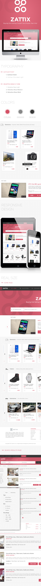

# Splendid Online Store
## An online E-Commerce Store.

> This project was developed as a learning project, part of the Microverse curriculum. This project is about building a static page for an online directory of real estate properties. The goal was to build the page to be as identical in the somewhat vague [specification](https://www.behance.net/gallery/24796463/ZATTIX).



## Project Description Video

🔗 [Loom Video Link](https://www.loom.com/share/f9b8ba20409944a4be63bd06378c44d6)

## Live demo

🔗 [Splendid Online Shop](https://raw.githack.com/CornerstoneII/HTML-CSS-Capstone/feature/index.html)

## Built With

- HTML5
- CSS3
- Font awesome
- Bootstrap 4
- Carousel from [Flickity](https://flickity.metafizzy.co)
- Image source from [unsplash.com](https://unsplash.com/)


## Getting Started

To get a local copy up and running follow these simple example steps.

### Prerequisites

Web browser and access to internet

### Install

1) [Download](Clone the repository to your machine)

```sh
https://github.com/CornerstoneII/HTML-CSS-Capstone.git
```

2) Navigate to the project folder and execute the "index.html" file.

### Usage

Just navigate through the page.

## Author

👤 **Oluwaseun Iyadi**

- Github: [@CornerstoneII](https://github.com/CornerstoneII)
- Twitter: [@It_Iz_I](https://twitter.com/It_Iz_I)
- Linkedin: [Oluwaseun Iyadi](https://www.linkedin.com/in/oluwaseun-iyadi-773584b4/)


## 🤝 Contributing

Contributions, issues and feature requests are welcome!

Feel free to check the [issues page](issues/).

## Show your support

Give a ⭐️ if you like this project!

## Acknowledgments

- Microverse for showing the way for this project to happen
- [Mohammed Awad on Behance](https://www.behance.net/M_Awad)